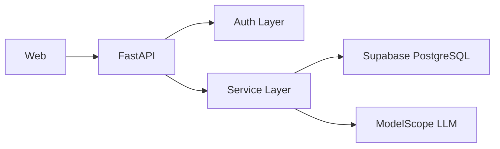

# 技术方案（Python + Supabase + Vercel + PWA）

## 0. 文档信息

- 版本: v1.2（整合版）
- 更新日期: 2026-02-15
- 范围: MVP 当前技术实现与约束

## 1. 方案结论

1. 后端框架: `FastAPI + Pydantic v2 + SQLAlchemy(async)`
2. 数据库: `Supabase PostgreSQL`（通过 Pooler）
3. 鉴权策略:
   - 线上: Supabase JWT
   - 本地开发: Mock Token（受开关控制）
4. 部署: 前后端均部署 Vercel，前端进入 PWA 形态
5. AI: ModelScope OpenAI-compatible API

## 2. 系统架构

## 3. 后端设计

### 3.1 分层

1. `api/routers`: 参数校验、路由编排、错误映射
2. `services`: 业务流程（会话、反馈、改写、总结）
3. `db`: 会话管理、SQL 与模型层

### 3.2 数据访问

- 生产与测试环境使用 `NullPool`（避免 serverless 连接池陈旧连接问题与测试事件循环污染）
- 开发环境使用默认连接池（提高本地稳定性）
- 统一开启 `pool_pre_ping`

## 4. 鉴权与安全

### 4.1 鉴权模式

1. `AUTH_MODE=supabase`：校验 Supabase JWT（线上默认）
2. `AUTH_MODE=mock`：`Authorization: Bearer mock_<uuid>`（本地联调）

### 4.2 生产保护

- `MOCK_AUTH_ENABLED=false`
- `ALLOW_MOCK_AUTH_IN_PRODUCTION=false`

### 4.3 数据隔离

- 已启用 RLS（核心业务表）
- 请求级注入 DB 上下文：`SET LOCAL ROLE authenticated` + JWT `sub`

## 5. 数据库策略

迁移按顺序执行：

1. `0001_init_nvc_practice.sql`
2. `0002_add_idempotency_keys.sql`
3. `0003_sync_auth_users_to_public_users.sql`
4. `0004_enable_rls_core_tables.sql`
5. `0005_fix_request_user_id_claim_resolution.sql`

说明：

- `0003` 用于 `auth.users` 同步到 `public.users`
- `0004/0005` 用于 RLS 与 claim 兼容修复

## 6. AI 调用策略

1. 统一经 `nvc_service` 输出结构化结果
2. 对模型异常返回做容错解析
3. 保持响应结构稳定，避免前端联调漂移

## 7. 部署与配置

### 7.1 Vercel

- 后端项目指向 `backend/`
- 前端项目指向 `web/`
- 生产域名:
  - 前端 `https://nvc-practice-web.vercel.app`
  - 后端 `https://nvc-practice-api.vercel.app`

### 7.2 PWA 设计（当前阶段）

1. `manifest.webmanifest`
   - `name`/`short_name`/`icons`/`theme_color`/`display=standalone`
2. Service Worker
   - 静态资源: `cache-first`
   - API 请求: `network-first`
3. 生命周期策略
   - 缓存版本号管理
   - 旧缓存清理
4. 体验策略
   - 安装入口（Install Prompt）
   - 离线状态提示
   - 新版本可更新提示
5. 离线快照策略
   - 历史会话列表本地快照（默认最近 20 条）
   - 单会话详情本地快照（按会话 id 存储）
   - 离线时优先回退到本地快照

### 7.3 关键环境变量

- `APP_ENV`
- `DATABASE_URL`
- `AUTH_MODE`
- `MOCK_AUTH_ENABLED`
- `SLOW_REQUEST_MS`
- `OBSERVABILITY_RECENT_ERROR_LIMIT`
- `SUPABASE_URL`
- `SUPABASE_ANON_KEY`
- `LLM_API_KEY`
- `LLM_MODEL`
- `OPENAI_BASE_URL`

## 8. 测试与预检

1. 单测: `pytest backend/tests -q`
2. OFNR 离线回归: `python scripts/run_ofnr_eval.py --mode offline`
3. OFNR 在线回归（可选）: `python scripts/run_ofnr_eval.py --mode online`
4. RLS 校验: `bash scripts/rls_isolation_check.sh`
5. Supabase JWT 冒烟: `bash scripts/supabase_jwt_api_smoke_test.sh <api_url>`
6. 一键预检: `bash scripts/release_preflight.sh <api_url>`
7. GitHub Actions 手动预检: `.github/workflows/release-preflight.yml`
8. PWA 手动验收:
   - 可安装
   - 离线可打开应用壳
   - API 离线提示正常
   - 更新提示可触发

补充:

- 当前线上预检已包含历史回看接口校验（`GET /api/v1/sessions`、`GET /api/v1/sessions/{session_id}/history`）
- 后端已提供最小可观测性端点 `GET /ops/metrics`（慢请求与 5xx 聚合）
- 预检默认集成 OFNR 离线 eval 门禁（`overall` 与 `risk_accuracy` 阈值）
- 可通过 `RUN_ONLINE_OFNR_EVAL=1` 启用在线模型回归（建议灰度启用）
- 在线回归默认采样 `8` 条（`OFNR_ONLINE_EVAL_MAX_CASES`），避免配额与限流导致大面积失败
- GitHub Actions `release-preflight` 已支持 `run_online_ofnr_eval` 手动参数
- PWA 冒烟脚本: `bash scripts/pwa_smoke_check.sh`

## 9. 当前技术边界

1. 远端 API 冒烟依赖执行环境网络可达性
2. 本地 DB 集成测试依赖 Docker/本地 Postgres 环境
3. 可观测性已具备本地聚合能力，当前阶段不做外部日志平台与告警通道接入
4. 微信小程序与安卓/iOS 原生 App 在当前阶段暂不开发
