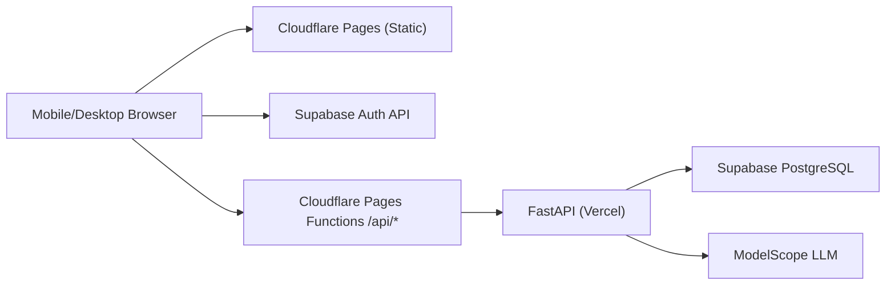

# 技术方案（Python + Supabase + PWA，Cloudflare A 已落地）

## 0. 文档信息

- 版本: v1.4（迁移复盘稳定版）
- 更新日期: 2026-02-23
- 范围: 当前线上架构、Cloudflare 迁移故障根因、修复方案与防回归规则

## 1. 当前结论（已实施）

1. 后端框架: `FastAPI + Pydantic v2 + SQLAlchemy(async)`
2. 数据库: `Supabase PostgreSQL`（Pooler 连接）
3. 鉴权策略:
   - 线上: Supabase JWT
   - 本地开发: Mock Token（受开关控制）
4. 当前部署基线:
   - 前端: Cloudflare Pages（静态 + Pages Functions）
   - 后端: Vercel（FastAPI）
5. 前端 API 调用策略（生产）:
   - 强制同域调用 `/api/*`
   - 由 Cloudflare Pages Functions 反向代理到 Vercel API
6. PWA/Service Worker 当前策略:
   - 不拦截导航请求
   - 不拦截 API 请求
   - 不缓存 `app.js`
   - 仅缓存样式/图片/字体等静态资源
7. AI: ModelScope OpenAI-compatible API

## 2. 系统架构（当前线上）

关键路径:

1. 页面资源: 浏览器 -> Cloudflare 静态资源
2. 业务接口: 浏览器 -> 同域 `/api/*` -> Pages Functions -> Vercel API
3. 登录鉴权: 浏览器 -> Supabase Auth（拿 JWT）-> 调后端接口

## 3. 后端设计

### 3.1 分层

1. `api/routers`: 参数校验、路由编排、错误映射
2. `services`: 业务流程（会话、反馈、改写、总结）
3. `db`: 会话管理、SQL 与模型层

### 3.2 数据访问

1. 生产与测试环境使用 `NullPool`（降低 serverless 连接池陈旧连接风险）
2. 开发环境使用默认连接池（本地联调更稳）
3. 统一开启 `pool_pre_ping`

## 4. 鉴权与安全

### 4.1 鉴权模式

1. `AUTH_MODE=supabase`: 校验 Supabase JWT（线上默认）
2. `AUTH_MODE=mock`: `Authorization: Bearer mock_<uuid>`（本地联调）

### 4.2 生产保护

1. `MOCK_AUTH_ENABLED=false`
2. `ALLOW_MOCK_AUTH_IN_PRODUCTION=false`

### 4.3 数据隔离

1. 核心业务表启用 RLS
2. 请求级注入 DB 上下文: `SET LOCAL ROLE authenticated` + JWT `sub`

## 5. 数据库策略

迁移执行顺序:

1. `0001_init_nvc_practice.sql`
2. `0002_add_idempotency_keys.sql`
3. `0003_sync_auth_users_to_public_users.sql`
4. `0004_enable_rls_core_tables.sql`
5. `0005_fix_request_user_id_claim_resolution.sql`

## 6. Cloudflare 迁移事故复盘（核心）

本次迁移不是单点故障，而是多因素叠加。以下按“用户看到的现象 -> 真实原因 -> 已落地修复”说明。

### 6.1 现象 A: 页面能打开，但刷新后偶发不可达

真实原因:

1. 早期 Service Worker 过度接管导航请求
2. 部分移动浏览器中 `Cache Storage` 异常会放大为导航失败（`ERR_FAILED`）

修复:

1. 取消导航拦截
2. 缓存读写增加容错
3. SW 版本连续滚动，清理旧缓存

实现位置:

- `web/sw.js`

### 6.2 现象 B: 登录后 1 秒出现“当前离线或网络不可用”

真实原因链:

1. 登录本身成功（Supabase）
2. 登录成功后前端会立即请求历史会话接口
3. 该请求在部分客户端仍打到旧 API 地址（历史本地配置）或经旧 SW 逻辑失败
4. 前端把 `fetch` 异常归类为 offline-like 错误，显示离线提示

修复:

1. 生产环境强制同域 API 基址（不再依赖历史本地 `api_base_url`）
2. 同域 `/api/*` 统一走 Cloudflare Functions 代理
3. SW 不再拦截 API

实现位置:

- `web/app.js`
- `functions/api/[[path]].js`

### 6.3 现象 C: Cloudflare 页面可访问，但业务接口全部失败

真实原因:

1. Cloudflare Pages 默认是静态托管
2. `vercel.json` 的 rewrite 规则不会被 Cloudflare 执行

修复:

1. 新增 Pages Functions 反向代理
2. `/health-backend` 单独提供后端连通健康检查

实现位置:

- `functions/api/[[path]].js`
- `functions/health-backend.js`

### 6.4 现象 D: 已部署新版本，但手机体验“像没更新”

真实原因:

1. 旧 SW 缓存命中旧 `app.js`
2. 客户端继续执行旧逻辑

修复:

1. SW 版本升级到 `v10`
2. 停止缓存 `app.js`
3. 发布后建议用一次 `?pwa=0` 清理旧 SW，再恢复正常访问

实现位置:

- `web/sw.js`

## 7. 当前部署与域名策略

### 7.1 当前稳定基线

1. 前端稳定域名: `https://nonviolent-communicator-stable.pages.dev`
2. 前端主域名: `https://nonviolent-communicator.pages.dev`
3. 后端目标: `https://nvc-practice-api.vercel.app`（由 Pages Functions 代理）
4. 健康检查: `<front-domain>/health-backend`

### 7.2 反向代理约束

1. 前端生产请求必须优先同域 `/api/*`
2. 仅在本地开发环境允许自定义 API 基址
3. 代理层必须透传 `Authorization` 与请求体
4. 代理返回必须带 `x-api-proxy: cloudflare-pages` 便于排查

### 7.3 发布与回滚

1. Cloudflare 前端发布: `scripts/cloudflare_pages_release.sh`
2. Vercel 后端发布/回滚: `scripts/vercel_release.sh`
3. 回滚优先级:
   - 前端先回滚到上一 Pages 部署
   - 后端保持 Vercel 稳定版本

## 8. 测试与预检（当前标准）

### 8.1 自动化

1. `pytest backend/tests -q`
2. `python scripts/run_ofnr_eval.py --mode offline`
3. `bash scripts/rls_isolation_check.sh`
4. `bash scripts/supabase_jwt_api_smoke_test.sh <front_domain>`
5. `bash scripts/pwa_smoke_check.sh`

### 8.2 迁移专项验收

按顺序执行（必须顺序化）:

1. 静态可达检查: `/`, `/diag`, `/ping.txt`
2. 代理可达检查: `/health-backend` 返回后端 JSON
3. 代理穿透检查: `OPTIONS /api/v1/scenes` CORS 预检成功
4. 业务烟测: 注册/登录 -> 创建场景 -> 会话 -> 消息 -> 总结 -> 历史 -> 周进度
5. PWA 验收: 安装、取消重试、刷新、版本更新

## 9. 防回归规则（迁移类变更必守）

1. 改 API 路由策略时，必须同时更新:
   - `web/app.js`
   - `functions/api/[[path]].js`
   - `docs/SETUP_AND_TESTING.md`
2. 改 SW 缓存策略时，必须:
   - 提升 `SW_VERSION`
   - 说明是否缓存 `app.js`
   - 补一次 PWA 烟测
3. 每次迁移发布后必须记录:
   - 发布域名
   - commit hash
   - 烟测结果
4. 文档必须同步到:
   - `docs/STAGE_REVIEW.md`
   - `docs/TECHNICAL_SOLUTION.md`
   - `docs/SETUP_AND_TESTING.md`

## 10. 当前技术边界

1. 海外链路在中国大陆网络仍有不确定性
2. Supabase Auth/DB 仍是跨境依赖
3. 当前阶段不接入外部日志平台/告警通道
4. 微信小程序与原生 App 暂不进入实现

## 11. 当前决策状态（已确认）

1. `A only` 已落地并稳定化: Cloudflare 前端 + Vercel 后端
2. `B`（Cloudflare + Render）暂不实施，仅保留为替代方案
3. 优先保障 Web/PWA 稳定可用，再讨论多端扩展
