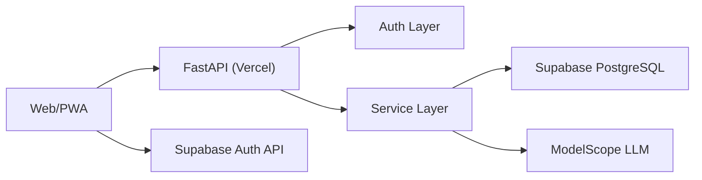
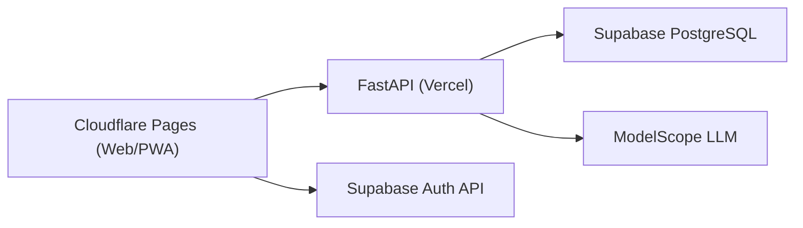
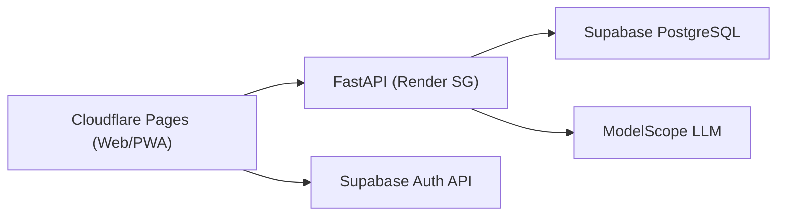

# 技术方案（Python + Supabase + PWA，含 Cloudflare/Render 迁移设计）

## 0. 文档信息

- 版本: v1.3（迁移设计版）
- 更新日期: 2026-02-22
- 范围: MVP 当前实现、部署迁移方案与约束

## 1. 方案结论

1. 后端框架: `FastAPI + Pydantic v2 + SQLAlchemy(async)`
2. 数据库: `Supabase PostgreSQL`（Pooler 连接）
3. 鉴权策略:
   - 线上: Supabase JWT
   - 本地开发: Mock Token（受开关控制）
4. 当前部署基线: 前后端在 Vercel，前端已 PWA 化
5. 迁移候选:
   - `方案 A`（最低改动）: Cloudflare Pages 前端 + 现有 Vercel 后端
   - `方案 B`（中改动）: Cloudflare Pages 前端 + Render 后端
6. AI: ModelScope OpenAI-compatible API

## 2. 系统架构（当前）

## 3. 后端设计

### 3.1 分层

1. `api/routers`: 参数校验、路由编排、错误映射
2. `services`: 业务流程（会话、反馈、改写、总结）
3. `db`: 会话管理、SQL 与模型层

### 3.2 数据访问

1. 生产与测试环境使用 `NullPool`（降低 serverless 连接池陈旧连接风险）
2. 开发环境使用默认连接池（本地联调更稳）
3. 统一开启 `pool_pre_ping`

## 4. 鉴权与安全

### 4.1 鉴权模式

1. `AUTH_MODE=supabase`: 校验 Supabase JWT（线上默认）
2. `AUTH_MODE=mock`: `Authorization: Bearer mock_<uuid>`（本地联调）

### 4.2 生产保护

1. `MOCK_AUTH_ENABLED=false`
2. `ALLOW_MOCK_AUTH_IN_PRODUCTION=false`

### 4.3 数据隔离

1. 核心业务表已启用 RLS
2. 请求级注入 DB 上下文: `SET LOCAL ROLE authenticated` + JWT `sub`

## 5. 数据库策略

迁移执行顺序:

1. `0001_init_nvc_practice.sql`
2. `0002_add_idempotency_keys.sql`
3. `0003_sync_auth_users_to_public_users.sql`
4. `0004_enable_rls_core_tables.sql`
5. `0005_fix_request_user_id_claim_resolution.sql`

## 6. AI 调用策略

1. 统一经 `nvc_service` 输出结构化结果
2. 对模型异常返回做容错解析
3. 保持响应结构稳定，避免前端联调漂移

## 7. 部署与迁移设计

### 7.1 当前生产基线（保留）

1. 前端: `https://nvc-practice-web.vercel.app`
2. 后端: `https://api.leonalgo.site`（备用 `https://nvc-practice-api.vercel.app`）
3. Vercel 发布与回滚脚本: `scripts/vercel_release.sh`

### 7.2 方案 A（推荐先落地）

Cloudflare 承接前端静态/PWA，后端仍在 Vercel。

最小改动点:

1. Cloudflare Pages 新建项目，根目录指向 `web/`
2. 前端 `apiBaseUrl` 默认指向 Vercel API 公网域名
3. 后端 CORS 增加 Cloudflare 域名（`*.pages.dev` 与可选自定义域名）
4. 保留现有后端代码与 Vercel 部署脚本

适用场景:

1. 预算优先、快速验证优先
2. 希望先提升前端页面可达性，再观察 API 质量

### 7.3 方案 B（作为 A 的增强备选）

前端在 Cloudflare，后端从 Vercel 迁至 Render（Python Web Service）。

改动点:

1. Render 新建 Python Web Service（仓库路径 `backend/`）
2. 启动命令示例: `uvicorn app.main:app --host 0.0.0.0 --port $PORT`
3. 全量迁移后端环境变量与健康检查（`/health`）
4. 前端 API 域名切换到 Render 服务域名
5. CORS 从 `vercel.app` 扩展到 `pages.dev` + `onrender.com` + 可选自定义域名

适用场景:

1. 方案 A 下 API 仍不稳定或延迟不可接受
2. 可接受 Render 免费实例冷启动带来的首次请求延迟

### 7.4 配置矩阵（迁移期）

| 配置项 | 方案 A | 方案 B |
| --- | --- | --- |
| 前端托管 | Cloudflare Pages | Cloudflare Pages |
| 后端托管 | Vercel | Render（Singapore） |
| 前端 API 默认地址 | `https://api.leonalgo.site` | `<render-api-domain>` |
| `CORS_ORIGINS` | `localhost + pages.dev + 自定义域` | `localhost + pages.dev + 自定义域` |
| `CORS_ORIGIN_REGEX` | 建议 `https://.*\\.pages\\.dev` | 建议 `https://.*\\.pages\\.dev` |
| 后端发布脚本 | `scripts/vercel_release.sh` | 新增 Render 发布步骤（文档化） |

### 7.5 发布与回滚策略

1. 方案 A 回滚:
   - Cloudflare 前端回滚到上一部署
   - API 继续使用现有 Vercel 稳定版本
2. 方案 B 回滚:
   - 前端回滚同上
   - API 域名切回 Vercel（保留 Vercel 后端作为热备）
3. 迁移期不移除现有 Vercel API，直到连续验收通过
4. 方案 A 发布脚本:
   - `bash scripts/cloudflare_pages_release.sh deploy <cf_pages_project_name>`

### 7.6 成本与体验预期

1. 方案 A: 新增成本几乎为 0，迁移速度最快
2. 方案 B: Render 免费可试运行，但存在 15 分钟空闲休眠与冷启动
3. 两个方案都不改变 Supabase 跨境依赖，不能承诺“大陆 100% 稳定”

## 8. 测试与预检

### 8.1 通用自动化

1. `pytest backend/tests -q`
2. `python scripts/run_ofnr_eval.py --mode offline`
3. `bash scripts/rls_isolation_check.sh`
4. `bash scripts/supabase_jwt_api_smoke_test.sh <api_url>`
5. `bash scripts/release_preflight.sh <api_url>`
6. `bash scripts/pwa_smoke_check.sh`

### 8.2 迁移专项验收

1. 首屏加载可达（4G/家宽各 1 轮）
2. 主链路: 注册/登录 -> 创建场景 -> 发送消息 -> 生成总结 -> 复盘
3. 历史会话列表与单会话回看
4. PWA 安装、取消后重试、离线壳、更新提示
5. 连续 24 小时内多次请求无大面积 `Failed to fetch`

## 9. 当前技术边界

1. 海外部署对中国大陆访问存在天然不确定性
2. Supabase Auth 与数据库仍为跨境链路
3. Render 免费实例有冷启动，不能作为稳定生产 SLA 承诺
4. 当前阶段不接入外部日志平台/告警通道
5. 微信小程序与原生 App 暂不进入实现

## 10. 当前决策状态（已确认）

1. 先执行 `A only`（Cloudflare Pages + Vercel API），不并行启动 `B`
2. Cloudflare 先用 `*.pages.dev` 完整验证，再评估接入 `leonalgo.site`
3. 方案 B 暂不实施，仅作为 A 失败时的替代路线
