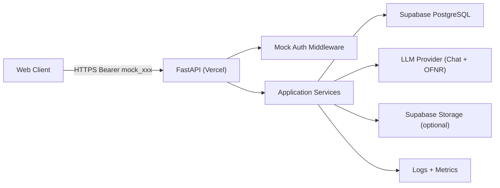

# Technical Solution (Python + Supabase + Vercel)

## 0. 文档信息

- 文档版本: v1.0
- 日期: 2026-02-10
- 目标: 基于现有 PRD v0.1-v0.3，定义可直接执行的技术实现方案
- 技术栈约束:
  - 后端: Python
  - 数据库: Supabase (PostgreSQL)
  - 鉴权: Mock Token (MVP 阶段)
  - 部署: Vercel Free

---

## 1. 方案结论（先看这个）

1. 后端框架采用 `FastAPI + Pydantic v2 + Uvicorn`。
2. 数据访问采用 `Supabase PostgreSQL (async SQLAlchemy + asyncpg, NullPool)`。
3. 鉴权先采用 `Mock Bearer Token`，接口层注入 `current_user_id`。
4. AI 逻辑采用“两段式服务”:
   - 对话生成服务
   - OFNR 分析/改写服务
5. 部署采用 `Vercel Python Serverless`，数据库走 Supabase Pooler。
6. 数据结构与接口契约继续沿用:
   - `spec/openapi/nvc-practice-coach.v1.yaml`
   - `db/migrations/0001_init_nvc_practice.sql`
7. 模型调用采用 ModelScope OpenAI 兼容网关:
   - `OPENAI_BASE_URL=https://api-inference.modelscope.cn/v1`
   - `LLM_MODEL=Qwen/Qwen3-Coder-480B-A35B-Instruct`

---

## 2. 总体架构



### 2.1 设计原则

1. 边界清晰: Router -> Service -> Repository 三层分离
2. 可替换: Mock Auth 可平滑替换成真实 Auth
3. 可回归: 评测集驱动 AI 质量迭代
4. 低耦合: OpenAPI 先行，前后端并行开发

---

## 3. 后端模块设计（FastAPI）

### 3.1 推荐目录结构

```text
backend/
  app/
    main.py
    api/
      deps.py
      routers/
        scenes.py
        sessions.py
        reflections.py
        progress.py
    core/
      config.py
      logging.py
      security.py
    db/
      session.py
      models.py
      repositories/
        scenes_repo.py
        sessions_repo.py
        messages_repo.py
        reflections_repo.py
        progress_repo.py
    schemas/
      scenes.py
      sessions.py
      reflections.py
      progress.py
      common.py
    services/
      scene_service.py
      session_service.py
      reflection_service.py
      progress_service.py
      ai/
        chat_service.py
        ofnr_service.py
        rewrite_service.py
  tests/
  pyproject.toml
  vercel.json
  .env.example
```

### 3.2 分层职责

1. Router
   - 参数校验、错误映射、响应封装
2. Service
   - 业务流程编排（例如消息发送 -> AI -> feedback 入库）
3. Repository
   - 只负责 SQLAlchemy ORM/SQL 操作
4. AI Service
   - 封装模型调用、超时、重试、降级策略

---

## 4. 鉴权方案（MVP Mock）

### 4.1 规则

1. 请求头: `Authorization: Bearer mock_<user_id>`
2. 示例: `Bearer mock_8a4c3f2a-2f88-4c74-9bc0-3123d26df302`
3. 后端中间件:
   - 校验前缀 `mock_`
   - 解析 `user_id`
   - 注入到 `request.state.user_id`

### 4.2 降级与错误

- 缺失 token -> `401 UNAUTHORIZED`
- token 格式错误 -> `401 UNAUTHORIZED`
- user 不存在 -> 自动创建最小用户记录（MVP 提升可用性）

### 4.3 后续切换路径（MVP 后）

1. 接 Supabase Auth/JWT 验签
2. `deps.get_current_user` 替换实现，不动业务层

---

## 5. 数据库与 Supabase 方案

### 5.1 运行时访问策略

1. Runtime 使用 `DATABASE_URL` 直连 Postgres（通过 Pooler）
2. 连接池策略:
   - Serverless 场景使用 `NullPool`
   - 每次请求短连接，避免连接泄漏
3. 事务边界:
   - 每个 API 请求一个事务
   - AI 外部调用与 DB 写入分阶段处理，避免长事务

### 5.2 迁移策略

1. 当前初始化脚本: `db/migrations/0001_init_nvc_practice.sql`
2. 推荐增加 `db/migrations/0002_add_constraints_xxx.sql` 等增量脚本
3. 发布流程:
   - 先跑 staging
   - 再跑 production

### 5.3 RLS 策略（建议）

MVP 可先不开 RLS，先由后端保证 `user_id` 访问隔离；  
进入公开测试前必须开启 RLS 并加策略。

---

## 6. AI 服务设计

### 6.1 能力拆分

1. `chat_service`:
   - 负责 AI 扮演对话方
2. `ofnr_service`:
   - 输出 OFNR 四维分析与风险等级
3. `rewrite_service`:
   - 生成替代句并保证“原意不偏移”

### 6.2 输入输出契约

- 输入:
  - 场景上下文
  - 最近 N 轮对话
  - 当前用户发言
- 输出:
  - assistant 回复
  - OFNR 结构化反馈
  - next_best_sentence

### 6.3 质量控制

1. 每次模型升级前跑 `spec/evals/ofnr_evalset_v0.1.jsonl`
2. 不达阈值不发布:
   - 风险等级命中率 >= 80%
   - OFNR 平均命中率 >= 75%
3. 对高风险输入增加安全拦截与降级回复

---

## 7. API 实现映射（按优先级）

### 7.1 P0（先完成）

1. `POST /scenes`
2. `POST /sessions`
3. `POST /sessions/{id}/messages`
4. `POST /sessions/{id}/rewrite`
5. `POST /sessions/{id}/summary`
6. `POST /reflections`
7. `GET /progress/weekly`

### 7.2 返回格式

全部严格对齐 `spec/openapi/nvc-practice-coach.v1.yaml`，避免前后端漂移。

---

## 8. Vercel 部署方案

### 8.1 部署形态

- 使用 Vercel Python Runtime 承载 ASGI（FastAPI）
- 路由统一转发到 `backend/app/main.py`
- Vercel 项目 `Root Directory` 设置为 `backend`

### 8.2 环境变量（Vercel Project Settings）

1. `APP_ENV=production`
2. `MOCK_AUTH_ENABLED=true`
3. `DATABASE_URL=<supabase_pooler_6543_url>`
4. `SUPABASE_URL=<project_url>`
5. `SUPABASE_SERVICE_ROLE_KEY=<server_only>`
6. `LLM_API_KEY=<modelscope_key>`
7. `LLM_MODEL=Qwen/Qwen3-Coder-480B-A35B-Instruct`
8. `OPENAI_BASE_URL=https://api-inference.modelscope.cn/v1`
9. `LOG_LEVEL=INFO`

### 8.3 发布流程

1. Push 到 `main` -> Vercel 自动构建
2. 健康检查 `GET /health`
3. 冒烟:
   - `POST /scenes`
   - `POST /sessions`
   - `POST /sessions/{id}/messages`

---

## 9. 安全与合规

### 9.1 强制规则

1. `SERVICE_ROLE_KEY` 仅后端使用，前端绝不下发
2. 敏感信息仅通过环境变量注入，不写入代码仓库
3. 日志默认脱敏（不记录完整 token、数据库密码）

### 9.2 当前风险提示

你在协作消息中暴露过密钥与数据库口令。建议在今天（2026-02-10）完成以下动作：

1. 立即轮换 Supabase Service Role Key
2. 立即轮换数据库口令
3. 轮换 Vercel Access Token
4. 新密钥仅写入 Vercel/Supabase Secret，不入库

---

## 10. 里程碑（2 周可落地）

### Sprint 1（第 1 周）

1. 搭建 FastAPI 基础工程
2. 跑通数据库迁移
3. 完成 `scenes/sessions/messages` 三条主链路
4. 接入 Mock Auth

### Sprint 2（第 2 周）

1. 完成 `rewrite/summary/reflections/progress`
2. 接入评测集回归脚本
3. 上线 Vercel Preview + Production
4. 完成 E2E 冒烟与故障预案

---

## 11. 你需要补充的最小信息

1. LLM 提供方和模型（例如 OpenAI 的具体模型名）
2. 首批公开测试目标用户规模（10/50/100）
3. 是否需要文件上传（语音或截图）进入 MVP
4. 前端是否与后端同仓（Monorepo）或分仓
